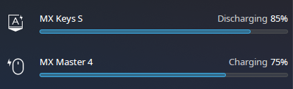

# LogiOps


This is an unofficial driver for Logitech mice and keyboard.

This is currently only compatible with HID++ \>2.0 devices.

## Fork Changes

This `fork` branch carries SR_team's local Logitech workflow changes on top of upstream logiops:

- Safer startup recovery and receiver probing for already-connected Logitech HID++ devices.
- Virtual touchpad gesture emulation for 3 and 4 finger gestures, with movement scale, direction inversion, and click fallback support.
- Custom command actions for diverted buttons.
- UPower battery publishing through virtual UHID devices, including charging state.
- Arch package metadata for `logiops-local-git`, conflicting with stock `logiops` packages, loading `uhid`, and restarting a running daemon during package upgrades.



## Configuration
[Refer to the wiki for details.](https://github.com/PixlOne/logiops/wiki/Configuration)

You may also refer to [logid.example.cfg](./logid.example.cfg) for an example.

Default location for the configuration file is /etc/logid.cfg, but another can be specified using the `-c` flag.

<details>
<summary>Run custom commands from a Logitech button</summary>

`Command` actions run on button release. Replace `/usr/bin/echo` with any executable and put its arguments in `args`. The daemon usually runs as root, so desktop-user commands may need a wrapper such as `runuser` or `systemd-run`.

```cfg
buttons: (
    {
        cid: 0x1a0;
        action =
        {
            type: "Command";
            command: "/usr/bin/echo";
            args: ["LogiOps command action"];
        };
    }
);
```

A `Command` can also be used as the `click` fallback for a touchpad gesture. When movement stays within `click_threshold`, the command runs on release instead of starting the virtual touchpad gesture.

```cfg
buttons: (
    {
        cid: 0x1a0;
        action =
        {
            type: "TouchpadGesture";
            fingers: 3;
            scale: 4.0;
            invert: false;
            click_threshold: 5;
            click =
            {
                type: "Command";
                command: "/usr/bin/echo";
                args: ["LogiOps touchpad click fallback"];
            };
        };
    }
);
```

</details>

<details>
<summary>Emulate 3 or 4 finger touchpad gestures</summary>

`TouchpadGesture` keeps virtual fingers down while the Logitech gesture button is held, moves them with mouse motion, and releases them when the button is released.

```cfg
buttons: (
    {
        cid: 0xc3;
        action =
        {
            type: "TouchpadGesture";
            fingers: 4;
            scale: 4.0;
            invert: false;
            click_threshold: 5;
        };
    },
    {
        cid: 0x1a0;
        action =
        {
            type: "TouchpadGesture";
            fingers: 3;
            scale: 4.0;
            invert: true;
            click_threshold: 5;
        };
    }
);
```

`fingers` is clamped to 3 or 4. `scale` multiplies the raw mouse movement. `invert` flips both axes. `click_threshold` is the amount of pointer movement allowed before the press becomes a touchpad gesture instead of a click fallback.

</details>

## Dependencies

This project requires a C++20 compiler, `cmake`, `libevdev`, `libudev`, `glib`, and `libconfig`.
For popular distributions, I've included commands below.

**Arch Linux:** `sudo pacman -S base-devel cmake libevdev libconfig systemd-libs glib2`

**Debian/Ubuntu:** `sudo apt install build-essential cmake pkg-config libevdev-dev libudev-dev libconfig++-dev libglib2.0-dev`

**Fedora:** `sudo dnf install cmake libevdev-devel systemd-devel libconfig-devel gcc-c++ glib2-devel`

**Gentoo Linux:** `sudo emerge dev-libs/libconfig dev-libs/libevdev dev-libs/glib dev-util/cmake virtual/libudev`

**Solus:** `sudo eopkg install cmake libevdev-devel libconfig-devel libgudev-devel glib2-devel`

**openSUSE:** `sudo zypper install cmake libevdev-devel systemd-devel libconfig-devel gcc-c++ libconfig++-devel libudev-devel glib2-devel`

## Installing This Fork

For Arch Linux and Arch-based systems, install this branch from the local PKGBUILD:

```bash
git clone --recursive --branch fork git@github.com:sr-tream/logiops.git
cd logiops/pkgbuild
makepkg -sriCc
```

If the repository is already checked out:

```bash
git fetch git@github.com:sr-tream/logiops.git fork:fork
git switch fork
cd pkgbuild
makepkg -sriCc
```

The package installs `logiops-local-git`, conflicts with `logiops` and `logiops-git`, provides `logiops`, writes `/usr/lib/modules-load.d/logiops.conf` to load `uhid` at boot, tries `modprobe uhid` on install or upgrade, and restarts `logid.service` only when the old instance is already running.

## Building

To build this project, run:

```bash
mkdir build
cd build
cmake -DCMAKE_BUILD_TYPE=Release ..
make
```

For this fork, the Arch package above is preferred because it also installs the `uhid` boot config and package upgrade hook. For manual builds, run `sudo make install` after building. You can set the daemon to start at boot by running `sudo systemctl enable logid` or `sudo systemctl enable --now logid` if you want to enable and start the daemon.

## Development

The project may only run as root, but for development purposes, you may find it
convenient to run as non-root on the user bus. You must compile with the CMake
flag `-DUSE_USER_BUS=ON` to use the user bus.

## Donate
This program is (and will always be) provided free of charge. If you would like to support the development of this project by donating, you can donate to my Ko-Fi below.

<a href='https://ko-fi.com/R6R81QQ9M' target='_blank'></a>

I'm also looking for contributors to help in my project; feel free to submit a pull request or e-mail me if you would like to contribute.

## Compatible Devices

[For a list of tested devices, check TESTED.md](TESTED.md)

## Credits

Logitech, Logi, and their logos are trademarks or registered trademarks of Logitech Europe S.A. and/or its affiliates in the United States and/or other countries. This software is an independent product that is not endorsed or created by Logitech.

Thanks to the following people for contributing to this repository.

- [Clément Vuchener & contributors for creating the old HID++ library](https://github.com/cvuchener/hidpp)
- [Developers of Solaar for providing information on HID++](https://github.com/pwr-Solaar/Solaar)
- [Nestor Lopez Casado for providing Logitech documentation on the HID++ protocol](http://drive.google.com/folderview?id=0BxbRzx7vEV7eWmgwazJ3NUFfQ28)
- Everyone listed in the contributors page
